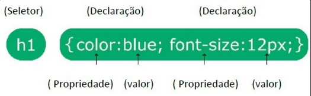
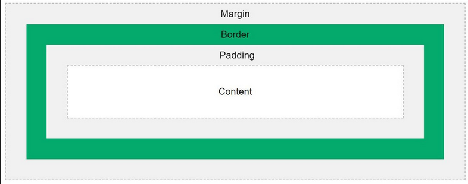

# Cascading Style Sheets (CSS)

Em português, Folhas de Estilo em Cascata.  
É um mecanismo simples para adicionar estilos.

**Sintaxe**  

## **Seletores**

### **Seletores ID**

Um id é um seletor que deve ser único em todo o documento HTML. Cada elemento pode ter apenas um id.

Os ids são usados quando você deseja estilizar um elemento específico e não pretende reutilizar o estilo.

Para selecionar um elemento por id no CSS, use uma hashtag `(#)` seguida pelo nome do id.

Exemplo:

    #cabecalho { font-size: 24px; }

### **Seletores class**

Uma classe é um seletor que pode ser aplicado a vários elementos em um documento HTML.

Você pode usar a mesma classe em múltiplos elementos para aplicar estilos semelhantes a eles.

Para selecionar um elemento por classe no CSS, use um ponto `(.)` seguido pelo nome da classe.

Exemplo:

    .botao-vermelho { color: red; }

### **Seletores universal**

O seletor universal `(*)` seleciona todos os elementos em um documento HTML.

É útil quando você deseja aplicar um estilo global a todos os elementos do documento.

No entanto, deve ser usado com cautela, pois pode afetar o desempenho do seu CSS, especialmente em documentos grandes.

Exemplo:

    * { margin: 0; padding: 0; }

### **Agrupamento de seletores**

O agrupamento de seletores permite aplicar o mesmo conjunto de estilos a múltiplos seletores.

Isso pode reduzir a repetição de código e tornar seu CSS mais conciso e legível.

Você pode agrupar seletores separando-os por vírgulas (,).

Exemplo:

    h1, h2, h3 { font-family: Arial, sans-serif; }

## **Como aplicar o CSS**

### **Externo**

O CSS externo é definido em um arquivo separado com extensão `.css` e, em seguida, é vinculado ao documento HTML usando a tag `<link>` no elemento ´`<head>``.

    <link rel="stylesheet" type="text/css" href="styles.css">

### **Interno (incorporado)**

O CSS interno é definido dentro da seção `

### **Inline**

O CSS inline é aplicado diretamente a um elemento HTML usando o atributo `style`.

`<h1 style="color: blue;">Este é um cabeçalho</h1>`

## **Hierarquia do CSS**

### **1. Importância:**

A importância é uma propriedade que pode ser atribuída a uma regra de estilo usando o valor `!important`.

Uma regra com `!important` sempre prevalecerá sobre outras regras, independentemente de sua especificidade ou ordem de declaração.

No entanto, o uso excessivo de !important pode dificultar a manutenção do código, então deve ser usado com moderação.  
 

### **2. Especificidade:**

A especificidade é a característica que determina qual regra CSS será aplicada a um elemento quando várias regras se aplicam a ele.

Cada seletor tem uma pontuação de especificidade atribuída, que é calculada com base nos tipos de seletores usados (id, classe, elemento).

Quanto mais específico for o seletor, maior será sua pontuação de especificidade.

Se houver um empate na especificidade, a regra que aparece por último no código prevalecerá.  
 

### **3. Ordem de Declaração:**

A ordem em que as regras CSS são declaradas também é importante.

Se duas regras têm a mesma especificidade, a última regra declarada prevalece.

Portanto, a ordem em que você define suas regras CSS no arquivo é crucial.

## **Comentários**

Os comentários são usados para explicar o código e podem ajudar você a editar o código-fonte posteriormente.

Eles não serão exibidos pelos navegadores.

Um comentário CSS é colocado dentro do `
    </head>
    <body>
        
    </body>
    </html>

Neste exemplo, a imagem será redimensionada automaticamente para se ajustar ao tamanho do contêiner pai, garantindo uma experiência responsiva em diferentes dispositivos e tamanhos de tela.

### **Picture**

A declaração ``<picture>`` é uma forma avançada de fornecer imagens flexíveis e responsivas em páginas da web.  

Permitindo que personalize a experiência visual de acordo com as características do dispositivo e do contexto de visualização.   

Isso é essencial para garantir uma experiência de usuário consistente e de alta qualidade em diferentes dispositivos e tamanhos de tela.

Ela permite que seja especificado várias fontes de imagem e condições de mídia para que o navegador possa escolher a melhor imagem com base nas características do dispositivo, como densidade de pixels, tamanho da tela e orientação.  

Isso é particularmente útil quando é necessário fornecer diferentes imagens para diferentes dispositivos ou contextos de visualização.  

Sintaxe:

    html

    <picture>
        <source srcset="imagem-grande.jpg" media="(min-width: 1200px)">
        <source srcset="imagem-media.jpg" media="(min-width: 600px)">
        
    </picture>

A declaração ``<picture>`` oferece suporte à técnica de "art direction", que é a prática de escolher diferentes imagens com base em considerações estéticas ou de layout específicas para diferentes contextos de visualização.

Exemplo de Uso:

    html

    <picture>
        <source srcset="imagem-grande.jpg" media="(min-width: 1200px)">
        <source srcset="imagem-media.jpg" media="(min-width: 600px)">
        
    </picture>

Neste exemplo:

Se a largura da janela do navegador for maior ou igual a 1200 pixels, o navegador carregará a imagem imagem-grande.jpg.  
Se a largura da janela do navegador for maior ou igual a 600 pixels (mas menor que 1200 pixels), o navegador carregará a imagem imagem-media.jpg.  
Se a largura da janela do navegador for menor que 600 pixels, o navegador carregará a imagem imagem-pequena.jpg.  

